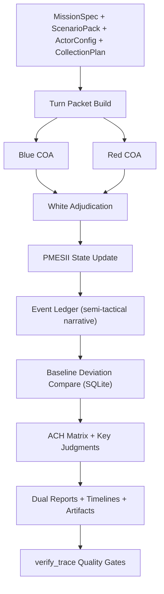

# Indo-Pacific PMESII Wargame Skill (V2.3)

[繁體中文說明 / Traditional Chinese](./README.zh-TW.md)

This project runs strategic-level PMESII wargames with one priority: every turn is replayable, and every conclusion is traceable.

If you need think-tank-style outputs (red/blue/white adjudication, ACH, decision reports) without black-box behavior, this is what the repo is built for.

## 1. Scope

Good fit:

- Strategic and policy simulation across PMESII.
- Red/Blue/White turn-based adjudication.
- Evidence-driven inference with audit trails.
- Dual reporting for executives and analysts.

Not a fit:

- Tactical fire-control or precise kill-chain models.
- Classified intel data pipelines.
- Live ISR streaming systems.

## 2. Architecture and Roles

Core cells:

- `Supreme Orchestrator`: controls run flow and sequencing.
- `Control Cell`: manages seeds, replayability, run indexing.
- `Blue Command`: composes blue-side COA.
- `Red Command`: composes red-side counter-COA.
- `White Cell`: adjudicates with `Legal/ROE`, `Probability`, and `Counterdeception`.
- `Intel Cell`: collection, vetting, fusion.
- `Analysis Cell`: ACH, sensitivity, indicator tracking.
- `Report Cell`: executive and analyst report generation.

Color roles:

- `Blue`: primary stabilizing/protected actor in default templates.
- `Red`: adversarial/challenging actor.
- `White`: referee and quality-control actor (non-combatant).

## 3. End-to-End Flow



Turn handshake:

1. Mission Context
2. Blue COA
3. Red COA
4. White Adjudication
5. PMESII State Update
6. Event Ledger + Story Cards
7. Indicators + Key Judgments
8. Next Turn Tasking

## 4. Baseline Database (SQLite)

Each run generates `actor_baseline_db.sqlite`.

Tables:

- `actors`
- `pmesii_baseline`
- `military_baseline`
- `economic_baseline`
- `diplomatic_baseline`
- `source_registry`

Current V2.3 baseline behavior:

- Uses structured, auditable baseline bands plus source-tier priors from `collection_plan`.
- Does not claim to be a full authoritative ORBAT database.
- Can be reused across runs; update/override as your research baseline matures.

## 5. Event Engine (Semi-Tactical Narrative)

Per-turn fixed event types:

- `military_movement`
- `simulated_engagement`
- `sanction_action`
- `diplomatic_mediation`
- `info_operation`
- `infrastructure_disruption`

Each `TurnEvent` includes:

- `event_id`, `turn_id`, `actor`, `target`, `location`, `time_window`
- `event_type`, `action_detail`, `estimated_outcome`
- `casualty_or_loss_band`
- `pmesii_delta`, `probability`, `confidence`
- `evidence_ids`, `assumption_links`

Fidelity guardrail:

- `simulated_engagement` outputs loss bands, not precise casualty counts.

## 6. Input Files

Minimum inputs:

- `in/mission.json`
- `in/scenario_pack.json`
- `in/actor_config.json`
- `in/collection_plan.json`

Bundled templates:

- Generic: `in/*.json`
- US-Iran set: `in/*_us_iran_20260305.json`

## 7. CLI

Full campaign:

```powershell
python scripts/run_campaign.py `
  --mission in/mission.json `
  --scenario in/scenario_pack.json `
  --actor-config in/actor_config.json `
  --collection-plan in/collection_plan.json `
  --out out/run_001 `
  --baseline-mode public_auto `
  --event-granularity semi_tactical `
  --fidelity-guardrail enabled `
  --report-profile dual_layer `
  --ach-profile full `
  --term-annotation inline_glossary `
  --narrative-mode event_cards `
  --length-policy warn `
  --min-chars-exec 2000 `
  --min-chars-analyst 5000 `
  --length-counting cjk_chars
```

Quality verification:

```powershell
python scripts/verify_trace.py `
  --mission in/mission.json `
  --evidence out/run_001/evidence.json `
  --event-ledger out/run_001/event_ledger.json `
  --baseline-deviation out/run_001/baseline_deviation_report.json `
  --key-judgments out/run_001/key_judgments.json `
  --ach out/run_001/ach_detailed.json `
  --report-exec out/run_001/report_exec.md `
  --report-analyst out/run_001/report_analyst.md `
  --length-policy warn
```

## 8. Outputs

Decision-facing:

- `report_exec.md`
- `report_analyst.md`
- `report.md` (compat alias of `report_exec.md`)
- `turn_timeline.md`
- `event_timeline.md`

Analysis and audit:

- `ach.json`, `ach_detailed.json`
- `key_judgments.json`
- `sensitivity.json`
- `evidence.json`
- `event_ledger.json`
- `baseline_deviation_report.json`
- `run_log.jsonl`
- `run_artifact.json`
- `report_metrics.json`
- `quality_gate_warnings.json`

Replay bundle (`replay_bundle/`):

- `turn_*_turn_packet.json`
- `turn_*_result.json`
- `turn_*_state.json`
- `turn_*_agent_log.json`
- `turn_*_event_ledger.json`
- `turn_*_story_cards.json`

## 9. Quality Gates (`verify_trace`)

Checks include:

- Key judgments must include both supporting and contradicting evidence.
- High-probability + high-confidence judgments must pass stricter source-independence thresholds.
- ACH detail must include elimination trace and diagnosticity.
- Event-to-evidence linkage must be complete (V2.3 path).
- Reports must include actionable recommendations and trigger thresholds.

Length policy:

- `warn`: warning only.
- `strict`: fail when below thresholds.
- `autofill`: enable auto-expansion flow.

## 10. Testing

Run all tests:

```powershell
python -m unittest discover -s tests -p "test_*.py"
```

Coverage highlights:

- ACH cell scoring and aggregation.
- Term/parameter dictionary completeness.
- Story-card required field shape.
- Baseline deviation scoring.
- Semi-tactical casualty precision guardrail.
- End-to-end pipeline and deterministic seed replay.

## 11. CI

GitHub Actions workflow: [`/.github/workflows/ci.yml`](./.github/workflows/ci.yml)

- Python 3.10 / 3.11 matrix
- Runs `python -m unittest discover -s tests -p "test_*.py"`

## 12. References

- [SKILL.md](./SKILL.md)
- [references/methodology.md](./references/methodology.md)
- [references/adjudication-rules.md](./references/adjudication-rules.md)
- [references/source-policy.md](./references/source-policy.md)
- [references/pmesii-indicator-dictionary.md](./references/pmesii-indicator-dictionary.md)
- [references/red-team-playbook.md](./references/red-team-playbook.md)
- [references/agent-handoffs.md](./references/agent-handoffs.md)
