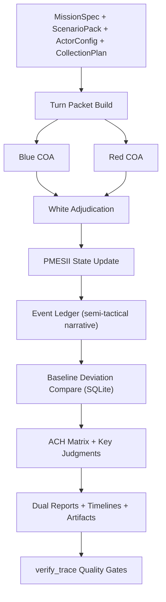

# Indo-Pacific PMESII Wargame Skill (V2.3)

[繁體中文說明 / Traditional Chinese](./README.zh-TW.md)

Strategic-level PMESII wargame skill with replayable turn logs, evidence traceability, ACH, baseline deviation analysis, and dual-layer reports.

This repository is built for think-tank-style simulation outputs (CSIS/RAND workflow style), but with explicit auditability and deterministic reruns.

## 1. Scope

This skill is for:

- Strategic/policy simulation with PMESII dimensions.
- Red/Blue/White adjudication.
- Turn-based evidence-driven inference.
- Replay, audit, and quality-gated reporting.

This skill is not for:

- Tactical fire-control or precise kill-chain resolution.
- Classified intelligence pipelines.
- Real-time ISR integration.

## 2. Architecture

Core cells:

- `Supreme Orchestrator`: run control and sequencing.
- `Control Cell`: seed, replay, run indexing.
- `Blue Command`: own-side integrated COA.
- `Red Command`: adversary COA and counteractions.
- `White Cell`: adjudication (`Legal/ROE`, `Probability`, `Counterdeception`).
- `Intel Cell`: collection, vetting, fusion.
- `Analysis Cell`: ACH, sensitivity, indicators.
- `Report Cell`: executive + analyst reporting.

Color roles:

- `Blue`: policy actor being protected/optimized (in default templates).
- `Red`: adversarial/challenging actor.
- `White`: referee and quality-control adjudicator.

## 3. End-to-End Flow



Per turn handshake:

1. Mission Context
2. Blue COA
3. Red COA
4. White Adjudication
5. PMESII State Update
6. Event Ledger + Story Cards
7. Indicators + Key Judgments
8. Tasking for Next Turn

## 4. Baseline Database (SQLite)

Generated automatically as `actor_baseline_db.sqlite` in run output.

Tables:

- `actors`
- `pmesii_baseline`
- `military_baseline`
- `economic_baseline`
- `diplomatic_baseline`
- `source_registry`

Important implementation note:

- Current V2.3 baseline values are calibrated defaults + source-tier priors from `collection_plan`, not a full authoritative ORBAT database.
- The baseline is reusable across runs, but should be refreshed/overridden as your research program matures.

## 5. Event Engine (Semi-Tactical, Guardrailed)

Turn events are generated with fixed types:

- `military_movement`
- `simulated_engagement`
- `sanction_action`
- `diplomatic_mediation`
- `info_operation`
- `infrastructure_disruption`

Each event row includes:

- `event_id`, `turn_id`, `actor`, `target`, `location`, `time_window`
- `event_type`, `action_detail`, `estimated_outcome`
- `casualty_or_loss_band` (band/range only)
- `pmesii_delta`, `probability`, `confidence`
- `evidence_ids`, `assumption_links`

Guardrail:

- No precise casualty numbers are emitted for simulated engagements.

## 6. Input Files

Minimum run inputs:

- `in/mission.json`
- `in/scenario_pack.json`
- `in/actor_config.json`
- `in/collection_plan.json`

Ready templates:

- Generic templates: `in/*.json`
- US-Iran scenario templates: `in/*_us_iran_20260305.json`

## 7. CLI

Main campaign:

```powershell
python scripts/run_campaign.py `
  --mission in/mission.json `
  --scenario in/scenario_pack.json `
  --actor-config in/actor_config.json `
  --collection-plan in/collection_plan.json `
  --out out/run_001 `
  --baseline-mode public_auto `
  --event-granularity semi_tactical `
  --fidelity-guardrail enabled `
  --report-profile dual_layer `
  --ach-profile full `
  --term-annotation inline_glossary `
  --narrative-mode event_cards `
  --length-policy warn `
  --min-chars-exec 2000 `
  --min-chars-analyst 5000 `
  --length-counting cjk_chars
```

Quality verification:

```powershell
python scripts/verify_trace.py `
  --mission in/mission.json `
  --evidence out/run_001/evidence.json `
  --event-ledger out/run_001/event_ledger.json `
  --baseline-deviation out/run_001/baseline_deviation_report.json `
  --key-judgments out/run_001/key_judgments.json `
  --ach out/run_001/ach_detailed.json `
  --report-exec out/run_001/report_exec.md `
  --report-analyst out/run_001/report_analyst.md `
  --length-policy warn
```

## 8. Outputs

Decision-facing:

- `report_exec.md`
- `report_analyst.md`
- `report.md` (alias of exec)
- `turn_timeline.md`
- `event_timeline.md`

Analytic and audit:

- `ach.json`, `ach_detailed.json`
- `key_judgments.json`
- `sensitivity.json`
- `evidence.json`
- `event_ledger.json`
- `baseline_deviation_report.json`
- `run_log.jsonl`
- `run_artifact.json`
- `report_metrics.json`
- `quality_gate_warnings.json`

Replay bundle:

- `replay_bundle/turn_*_turn_packet.json`
- `replay_bundle/turn_*_result.json`
- `replay_bundle/turn_*_state.json`
- `replay_bundle/turn_*_agent_log.json`
- `replay_bundle/turn_*_event_ledger.json`
- `replay_bundle/turn_*_story_cards.json`

## 9. Quality Gates

`verify_trace.py` checks:

- Key judgments include both supporting and contradicting evidence.
- High-probability + high-confidence judgments satisfy stricter source-independence threshold.
- ACH detail includes elimination trace and diagnosticity.
- Event and evidence linkage is complete (V2.3 path).
- Reports include actionable recommendations and trigger thresholds.

Length policy:

- `warn`: warning only.
- `strict`: fail run when threshold is missed.
- `autofill`: auto-extend report text generation path.

## 10. Testing

Run all tests:

```powershell
python -m unittest discover -s tests -p "test_*.py"
```

What tests cover:

- ACH cell scoring and aggregation behavior.
- Term dictionary completeness.
- Story-card shape and required narrative fields.
- Baseline deviation scoring.
- Semi-tactical casualty precision guardrail.
- End-to-end pipeline + reproducible seed behavior.

## 11. CI

GitHub Actions workflow (`.github/workflows/ci.yml`) runs:

- Python 3.10 + 3.11 matrix
- `python -m unittest discover -s tests -p "test_*.py"`

## 12. References

- [SKILL.md](./SKILL.md)
- [references/methodology.md](./references/methodology.md)
- [references/adjudication-rules.md](./references/adjudication-rules.md)
- [references/source-policy.md](./references/source-policy.md)
- [references/pmesii-indicator-dictionary.md](./references/pmesii-indicator-dictionary.md)
- [references/red-team-playbook.md](./references/red-team-playbook.md)
- [references/agent-handoffs.md](./references/agent-handoffs.md)
