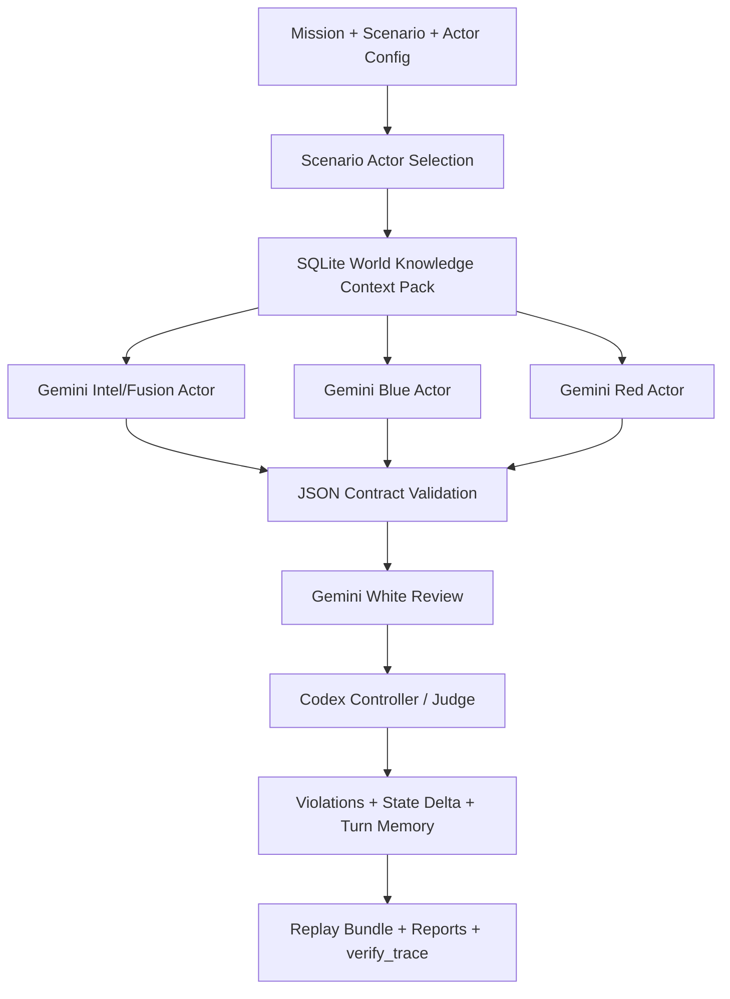

# Indo-Pacific PMESII Wargame Skill (V4)

[繁體中文說明 / Traditional Chinese](./README.zh-TW.md)

This repository is a Codex skill for strategic-level Indo-Pacific and Middle East PMESII wargames. V4 uses a Gemini actor engine, a Codex/Python controller, and a SQLite world knowledge database so that every turn is role-grounded, rule-checked, and replayable.

V4 is designed for policy, strategy, crisis-management, and structured analytic exercises. It uses model-level military and PMESII grounding, but it does not provide real-time targeting, classified ORBAT, or precise casualty prediction.

## What This Is

The current workflow is actor-driven:

- Gemini plays concrete actors such as the United States, China, Taiwan, Japan, Iran, Israel, NATO, GCC, Houthis, or Hezbollah.
- Codex/Python prepares turn packets, queries SQLite context, validates actor JSON, applies constraints, records violations, and integrates the report.
- SQLite stores actor identity, PMESII indicators, capability rules, military platform bands, source provenance, and turn memory.
- The legacy deterministic engine remains available as a local fallback through `--engine local_synthetic`.

The abstract `Blue`, `Red`, `White`, and `Neutral` labels are scenario roles. V4 maps them onto concrete countries, organizations, or non-state actors for each run.

## V4 Architecture


```mermaid
flowchart TD
    A["Mission + Scenario + Actor Config"] --> B["Scenario Actor Selection"]
    B --> C["SQLite World Knowledge Context Pack"]
    C --> D["Gemini Intel/Fusion Actor"]
    C --> E["Gemini Blue Actor"]
    C --> F["Gemini Red Actor"]
    D --> G["JSON Contract Validation"]
    E --> G
    F --> G
    G --> H["Gemini White Review"]
    H --> I["Codex Controller / Judge"]
    I --> J["Violations + State Delta + Turn Memory"]
    J --> K["Replay Bundle + Reports + verify_trace"]
```

Core responsibilities:

- `Gemini actors`: roleplay concrete actors and return structured JSON only.
- `Codex controller`: observe, validate, adjudicate, constrain, and explain actor outputs.
- `Python scripts`: orchestrate runs, build context packs, validate schemas, persist artifacts, and run quality gates.
- `SQLite knowledge DB`: provide reusable actor baselines, PMESII context, capability grounding, military modeling data, and provenance.

## How a V4 Turn Runs

Each `gemini_actor` turn follows this pipeline:

1. Build a turn packet from `mission.json`, `scenario_pack.json`, `actor_config.json`, and `collection_plan.json`.
2. Select concrete actors for the scenario and map them to Blue/Red/White/Neutral/Non-state roles.
3. Query `data/wargame_knowledge.sqlite` for actor PMESII metrics, capabilities, constraints, military platforms, interaction rules, source claims, and recent turn memory.
4. Render actor prompts from `assets/prompts/`.
5. Call Gemini through the actor wrapper, or use deterministic mock actors with `--mock-gemini`.
6. Validate every actor response against JSON schemas under `assets/schemas/`.
7. Run Codex controller checks for unsupported capabilities, missing database grounding, unbounded escalation, ignored countermeasures, and missing White dissent.
8. Persist prompts, raw responses, parsed JSON, validation reports, violations, controller decisions, and replay artifacts.

Gemini actor prose is never allowed to mutate state directly. Only validated JSON plus controller-adjudicated deltas enter the replay record.

## SQLite World Knowledge DB

V4 upgrades the database from a small baseline store into `data/wargame_knowledge.sqlite`, a stable local actor and world-context database. Run outputs keep manifests and context packs; the main knowledge DB does not live under `out/`.

Major table groups:

- Actor registry: `world_actors`, `actor_aliases`, `actor_bloc_roles`
- PMESII modeling: `actor_pmesii_metrics`, `metric_sources`
- Military modeling: `military_platforms`, `platform_capabilities`, `weapon_interactions`, `force_posture`
- Capability rules: `capability_rules`, `capability_triggers`, `capability_effects`, `capability_constraints`
- Provenance: `source_documents`, `source_claims`, `field_provenance`
- Diagnostics: `quality_diagnostics`, `benchmark_cases`
- Compatibility layer: `actors`, `actor_doctrine`, `pmesii_indicators`, `capabilities`, `constraints`, `turn_memory`

Seed coverage currently focuses on Indo-Pacific and Middle East actors: US, China, Russia, Taiwan, Japan, South Korea, North Korea, Iran, Israel, Saudi Arabia, UAE, Qatar, Turkey, UK, France, Germany, Australia, India, Vietnam, Philippines, Singapore, NATO, EU, GCC, Houthis, and Hezbollah.

See [references/sqlite-knowledge-schema.md](./references/sqlite-knowledge-schema.md), [references/world-kb-schema.md](./references/world-kb-schema.md), and [references/world-kb-source-policy.md](./references/world-kb-source-policy.md).

## Military Modeling Layer

The military layer is strategic and model-level. It records inventory bands, platform families, domains, roles, readiness bands, effect classes, countermeasure logic, and interaction classes.

It supports checks such as:

- whether an actor has the platform or capability it claims to use;
- whether a capability has plausible preconditions, latency, costs, and risks;
- whether opposing actors have relevant countermeasures;
- whether an event is grounded in PMESII and capability context.

It intentionally uses quantity bands and effect ranges instead of fake precision. Local war events can be generated for narrative and analytic purposes, while exact loss counts remain outside scope.

See [references/military-modeling-rules.md](./references/military-modeling-rules.md).

## Quick Start

Run a deterministic V4 Gemini-actor smoke campaign:

```powershell
python scripts/run_campaign.py `
  --mission in/mission.json `
  --scenario in/scenario_pack.json `
  --actor-config in/actor_config.json `
  --collection-plan in/collection_plan.json `
  --out out/v4_mock_run `
  --engine gemini_actor `
  --mock-gemini `
  --turns 1
```

Use `--knowledge-db <path>` on `run_campaign.py` or `run_turn.py` when a scenario needs a separate local knowledge DB. Without that override, both commands use `data/wargame_knowledge.sqlite`.

Build and inspect the V4 world knowledge database:

```powershell
python scripts/world_kb_import.py `
  --db data/wargame_knowledge.sqlite `
  --mission in/mission.json `
  --scenario in/scenario_pack.json `
  --actor-config in/actor_config.json `
  --collection-plan in/collection_plan.json `
  --references-dir references `
  --context-actor Blue
```

Run the local deterministic fallback:

```powershell
python scripts/run_campaign.py `
  --mission in/mission.json `
  --scenario in/scenario_pack.json `
  --actor-config in/actor_config.json `
  --collection-plan in/collection_plan.json `
  --out out/local_synthetic_run `
  --engine local_synthetic `
  --turns 1
```

## Knowledge DB Query CLI

Use `scripts/query_knowledge_db.py` as the stable LLM-facing query interface. Gemini, GPT, and controller tools should call this CLI instead of writing ad hoc SQL.

```powershell
python scripts/query_knowledge_db.py manifest --format json --pretty
python scripts/query_knowledge_db.py actor-search --keyword Taiwan --format json
python scripts/query_knowledge_db.py scenario-actors --mission in/mission.json --scenario in/scenario_pack.json --format json
python scripts/query_knowledge_db.py actor-context --actor China --mission in/mission.json --scenario in/scenario_pack.json --question "Taiwan Strait pressure options" --format json --pretty
python scripts/query_knowledge_db.py pmesii --actor PRC --dimension M --format json
python scripts/query_knowledge_db.py capabilities --actor China --format json
python scripts/query_knowledge_db.py platforms --actor Taiwan --format json
python scripts/query_knowledge_db.py interactions --family air_defense --format json
python scripts/query_knowledge_db.py sources --actor Taiwan --format json
```

The CLI accepts actor ids, aliases, display names, and scenario roles. Scenario roles such as `Blue` or `Red` require `--mission` and `--scenario` so the role can be mapped to concrete actors. Use `--max-items`, `--max-chars`, and `--no-sources` to keep prompts compact.

## Outputs and Replay Artifacts

Typical V4 knowledge and run outputs include:

- `data/wargame_knowledge.sqlite`
- `out/<run>/knowledge_db_manifest.json`
- `replay_bundle/turn_*_actor_context_pack.json`
- `replay_bundle/turn_*_gemini_calls/`
- `replay_bundle/turn_*_controller_decision.json`
- `replay_bundle/turn_*_violations.json`
- `event_ledger.json`
- `key_judgments.json`
- `ach_detailed.json`
- `report_exec.md`
- `report_analyst.md`
- `verify_trace.json`

`data/wargame_knowledge.sqlite` is the long-lived local knowledge DB. `out/<run>/knowledge_db_manifest.json` records the DB state used by a run, and `replay_bundle/turn_*_actor_context_pack.json` records what each actor saw during the turn. Each Gemini call directory stores `prompt.md`, `raw_response.txt`, `parsed.json`, and `validation.json` when the actor pipeline runs.

## Source Policy and Quality Gates

The database is built for traceability. High-impact fields should carry source URL, publisher, captured time, data year, confidence, and field-level provenance.

Preferred source tiers:

- Tier A: official government, defense, treaty, budget, and statistical sources.
- Tier B: SIPRI, CIA World Factbook, IISS-style military balance references, and other curated institutional datasets.
- Tier C: Wikipedia/Wikidata for broad actor baseline coverage and cross-checking.
- Tier D: scenario-specific open-source claims captured into replay artifacts.

Quality gates include:

- evidence and replay completeness;
- ACH and key-judgment consistency;
- actor JSON contract validation;
- PMESII grounding;
- capability and platform grounding;
- source provenance coverage;
- White dissent and controller violation behavior.

## Tests

```powershell
python -m unittest discover -s tests -p test_v2_unit.py
python -m unittest discover -s tests -p test_pipeline.py
```

Useful manual smoke checks:

```powershell
python scripts/world_kb_import.py `
  --db data/wargame_knowledge.sqlite `
  --mission in/mission.json `
  --scenario in/scenario_pack.json `
  --actor-config in/actor_config.json `
  --collection-plan in/collection_plan.json `
  --references-dir references `
  --context-actor Blue

python scripts/run_campaign.py `
  --mission in/mission.json `
  --scenario in/scenario_pack.json `
  --actor-config in/actor_config.json `
  --collection-plan in/collection_plan.json `
  --out out/v4_mock_run `
  --engine gemini_actor `
  --mock-gemini `
  --turns 1
```

## Legacy V2.5 Compatibility

The V2.5 local simulator remains available for deterministic runs, evidence-mode experiments, and regression tests. It still supports:

- `synthetic`, `hybrid`, and `live_limited` evidence modes;
- source capture manifests, claim registries, and evidence clusters;
- AI expert review outputs;
- baseline deviation reports;
- event cards and semi-tactical narrative ledgers.

V2.5 artifacts and `actor_baseline_db.sqlite` remain useful for backward compatibility. V4 uses `data/wargame_knowledge.sqlite` as the primary knowledge layer.

## Current Limits

- The V4 seed database is a first-pass world knowledge layer. Some actors have thinner PMESII or capability coverage than US/CN/TW/IR/IL-style core actors.
- Military data is model-level and banded. It supports strategic grounding and violation checks, not precise tactical adjudication.
- Live source refresh is not a full automated ingestion system yet. V4 records provenance and provides the schema needed for later ingestion upgrades.
- Commercial or licensed military references must be handled according to their licensing terms before being imported.

## Reference Files

- [SKILL.md](./SKILL.md)
- [references/gemini-actor-workflow.md](./references/gemini-actor-workflow.md)
- [references/controller-adjudicator-rules.md](./references/controller-adjudicator-rules.md)
- [references/agent-handoffs.md](./references/agent-handoffs.md)
- [references/sqlite-knowledge-schema.md](./references/sqlite-knowledge-schema.md)
- [references/world-kb-schema.md](./references/world-kb-schema.md)
- [references/world-kb-source-policy.md](./references/world-kb-source-policy.md)
- [references/military-modeling-rules.md](./references/military-modeling-rules.md)
- [references/pmesii-normalization.md](./references/pmesii-normalization.md)
