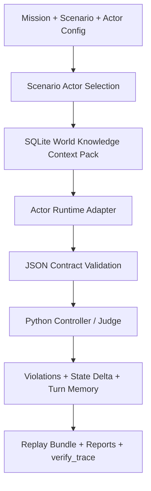

# Indo-Pacific PMESII Wargame Skill

[](https://github.com/show940125/indo-pacific-pmesii-wargame-skill/actions/workflows/ci.yml)
[](./LICENSE)

[Traditional Chinese / 繁體中文](./README.zh-TW.md) | [Changelog](./CHANGELOG.md) | [Apache-2.0 License](./LICENSE)

> Development status: V5 baseline with V6 development additions.

## Overview

This open-source skill supports replayable, source-traceable strategic PMESII wargames for Indo-Pacific and Middle East scenarios. A Python controller builds turn packets, queries a SQLite world knowledge database, validates actor JSON, applies constraints, records violations, and produces replay bundles and reports.

The project is designed for policy, strategy, crisis-management, research, and structured analytic exercises. It does not provide real-time targeting, classified orders of battle, or precise casualty prediction.

## Why This Project Matters

The repository packages actor simulation, rule checking, source provenance, quality gates, and replay artifacts into reusable open-source infrastructure. It helps analysts inspect how a scenario evolved instead of relying on opaque narrative output.

## Runtime Profiles

The repository keeps one shared controller core while allowing environment-specific actor execution:

| Profile | Actor execution | Shared core |
| --- | --- | --- |
| Gemini / Antigravity plugin | Native Antigravity subagents | Python controller, SQLite KB, schemas, prompts, tests, replay artifacts |
| Codex skill | Planned Antigravity CLI bridge used as an actor-like subagent runtime | Same shared core |

The Codex Antigravity CLI bridge is planned adapter work, not a currently supported runtime. Runtime launchers, authentication, subagent wiring, and deployment settings must remain environment-specific.

### Synchronization Rules

- Canonical source: the Git repository nested inside the Gemini / Antigravity plugin deployment.
- Shared across deployments: license, changelog, READMEs, schemas, controller logic, SQLite KB, prompts, and tests.
- Maintained separately: runtime launchers, OAuth or CLI bridges, native Antigravity subagent settings, and Codex deployment settings.
- The existing Codex installation is a deployment copy and is not overwritten automatically.

## Capabilities

- Concrete actors for countries, alliances, and non-state organizations.
- SQLite-backed PMESII context, capability rules, military platform bands, provenance, and turn memory.
- JSON contract validation and controller-adjudicated state mutation.
- Stochastic combat resolution, geographic transit delays, stockpile depletion, and dynamic constraints.
- Deterministic mock actors and `local_synthetic` fallback for regression tests.

## Architecture


```mermaid
flowchart TD
    A["Mission + Scenario + Actor Config"] --> B["Scenario Actor Selection"]
    B --> C["SQLite World Knowledge Context Pack"]
    C --> D["Actor Runtime Adapter"]
    D --> E["JSON Contract Validation"]
    E --> F["Python Controller / Judge"]
    F --> G["Violations + State Delta + Turn Memory"]
    G --> H["Replay Bundle + Reports + verify_trace"]
```

Validated actor JSON and controller-adjudicated deltas are the only inputs allowed to mutate state. See [SKILL.md](./SKILL.md) and [references/controller-adjudicator-rules.md](./references/controller-adjudicator-rules.md) for the detailed workflow.

## Quick Start

Run a deterministic smoke campaign:

```powershell
python scripts/run_campaign.py `
  --mission in/mission.json `
  --scenario in/scenario_pack.json `
  --actor-config in/actor_config.json `
  --collection-plan in/collection_plan.json `
  --out out/v6_mock_run `
  --engine gemini_actor `
  --mock-gemini `
  --turns 1
```

Build and inspect the world knowledge database:

```powershell
python scripts/world_kb_import.py `
  --db data/wargame_knowledge.sqlite `
  --mission in/mission.json `
  --scenario in/scenario_pack.json `
  --actor-config in/actor_config.json `
  --collection-plan in/collection_plan.json `
  --references-dir references `
  --context-actor Blue
```

Use `scripts/query_knowledge_db.py` as the stable LLM-facing query interface. Use `--knowledge-db <path>` on `run_campaign.py` or `run_turn.py` when a scenario needs an isolated database.

## Outputs and Replay Artifacts

Typical outputs include:

- `data/wargame_knowledge.sqlite`
- `out/<run>/knowledge_db_manifest.json`
- `replay_bundle/turn_*_actor_context_pack.json`
- `replay_bundle/turn_*_actor_calls/`
- `replay_bundle/turn_*_controller_decision.json`
- `replay_bundle/turn_*_violations.json`
- `event_ledger.json`
- `key_judgments.json`
- `ach_detailed.json`
- `report_exec.md`, `report_analyst.md`, `report_news.md`
- `verify_trace.json`

## Source Policy and Quality Gates

High-impact database fields should carry source URL, publisher, captured time, data year, confidence, and field-level provenance. Preferred sources range from official government, defense, treaty, budget, and statistical material to curated institutional datasets and cross-checking sources.

Quality gates cover replay completeness, ACH consistency, actor JSON contracts, PMESII grounding, capability and platform grounding, provenance coverage, dissent, and controller violation behavior. Commercial or licensed military references must be handled according to their licensing terms before import.

## Tests and CI

GitHub Actions runs the test suite on Python 3.10 and 3.11.

```powershell
python -m unittest discover -s tests -p "test_*.py"
```

## Current Limits

- The seed database remains a first-pass world knowledge layer; some actors have thinner coverage than core actors.
- Military data is model-level and banded, supporting strategic grounding rather than precise tactical adjudication.
- Live source refresh is not yet a full automated ingestion system.
- The Codex Antigravity CLI actor bridge remains planned adapter work.

## Version History

See [CHANGELOG.md](./CHANGELOG.md) for the tagged `v2.3.0` release and later development milestones.

## License

Licensed under the [Apache License 2.0](./LICENSE). See [NOTICE](./NOTICE) for attribution.
