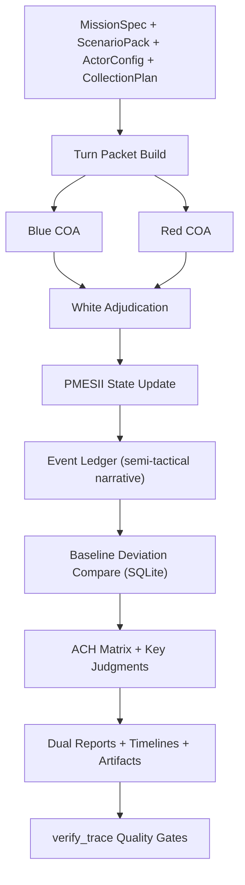

# Indo-Pacific PMESII 兵推 Skill（V2.3）

[English Version](./README.md)

這個專案用來跑戰略層 PMESII 兵推。重點不是「做得很花」，而是每一回合都能回放、每個結論都能追到證據，方便研究團隊複核與重跑。

## 1. 適用範圍

適合的場景：

- 戰略與政策層推演（PMESII 六維）。
- 紅藍白分工裁決。
- 回合制、可重現、可稽核的研究流程。
- 需要雙層報告（主管版 + 分析師版）。

不適合的場景：

- 戰術級射擊/毀傷精算。
- 機密情資管線。
- 即時 ISR 串流決策。

## 2. 架構與角色

核心單元：

- `Supreme Orchestrator`：控制整個 run 的節奏與順序。
- `Control Cell`：管理 seed、重現性、run 索引。
- `Blue Command`：整合藍隊 COA（Course of Action）。
- `Red Command`：整合紅隊反制行動。
- `White Cell`：裁決核心，含 `Legal/ROE`、`Probability`、`Counterdeception`。
- `Intel Cell`：蒐集、來源檢核、融合。
- `Analysis Cell`：ACH、敏感度、指標盤。
- `Report Cell`：輸出主管版與分析師版報告。

顏色角色：

- `Blue`：主要防禦/維穩方（預設模板中的主體）。
- `Red`：對抗與施壓方。
- `White`：裁判與品質控管方（不參戰）。

## 3. 端到端流程



每回合固定交握：

1. Mission Context
2. Blue COA
3. Red COA
4. White Adjudication
5. PMESII State Update
6. Event Ledger + Story Cards
7. Indicators + Key Judgments
8. Next Turn Tasking

## 4. 基底資料庫（SQLite）

執行時會自動生成 `actor_baseline_db.sqlite`。

資料表：

- `actors`
- `pmesii_baseline`
- `military_baseline`
- `economic_baseline`
- `diplomatic_baseline`
- `source_registry`

目前版本重點：

- V2.3 基線屬於「可稽核參數化基線 + 來源層級先驗」。
- 不是完整 ORBAT 權威資料庫。
- 可以跨 run 重用，也建議依研究需求定期覆蓋更新。

## 5. 事件引擎（半戰術敘事）

每回合會生成固定事件型別：

- `military_movement`
- `simulated_engagement`
- `sanction_action`
- `diplomatic_mediation`
- `info_operation`
- `infrastructure_disruption`

每筆事件固定欄位：

- `event_id`, `turn_id`, `actor`, `target`, `location`, `time_window`
- `event_type`, `action_detail`, `estimated_outcome`
- `casualty_or_loss_band`
- `pmesii_delta`, `probability`, `confidence`
- `evidence_ids`, `assumption_links`

精度護欄：

- `simulated_engagement` 不輸出精確傷亡數字，只用區間/等級描述。

## 6. 輸入檔案

最小輸入：

- `in/mission.json`
- `in/scenario_pack.json`
- `in/actor_config.json`
- `in/collection_plan.json`

內建範本：

- 通用範本：`in/*.json`
- 美伊情境範本：`in/*_us_iran_20260305.json`

## 7. CLI 用法

完整 campaign：

```powershell
python scripts/run_campaign.py `
  --mission in/mission.json `
  --scenario in/scenario_pack.json `
  --actor-config in/actor_config.json `
  --collection-plan in/collection_plan.json `
  --out out/run_001 `
  --baseline-mode public_auto `
  --event-granularity semi_tactical `
  --fidelity-guardrail enabled `
  --report-profile dual_layer `
  --ach-profile full `
  --term-annotation inline_glossary `
  --narrative-mode event_cards `
  --length-policy warn `
  --min-chars-exec 2000 `
  --min-chars-analyst 5000 `
  --length-counting cjk_chars
```

品質驗證：

```powershell
python scripts/verify_trace.py `
  --mission in/mission.json `
  --evidence out/run_001/evidence.json `
  --event-ledger out/run_001/event_ledger.json `
  --baseline-deviation out/run_001/baseline_deviation_report.json `
  --key-judgments out/run_001/key_judgments.json `
  --ach out/run_001/ach_detailed.json `
  --report-exec out/run_001/report_exec.md `
  --report-analyst out/run_001/report_analyst.md `
  --length-policy warn
```

## 8. 主要輸出

決策閱讀輸出：

- `report_exec.md`
- `report_analyst.md`
- `report.md`（`report_exec.md` 相容別名）
- `turn_timeline.md`
- `event_timeline.md`

分析與稽核輸出：

- `ach.json`, `ach_detailed.json`
- `key_judgments.json`
- `sensitivity.json`
- `evidence.json`
- `event_ledger.json`
- `baseline_deviation_report.json`
- `run_log.jsonl`
- `run_artifact.json`
- `report_metrics.json`
- `quality_gate_warnings.json`

回放輸出（`replay_bundle/`）：

- `turn_*_turn_packet.json`
- `turn_*_result.json`
- `turn_*_state.json`
- `turn_*_agent_log.json`
- `turn_*_event_ledger.json`
- `turn_*_story_cards.json`

## 9. 品質閘門（verify_trace）

`verify_trace.py` 會檢查：

- KJ 同時有支持與反證證據。
- 高機率 + 高信心 KJ 達到更嚴的獨立來源門檻。
- ACH 明細包含 elimination trace 與 diagnosticity。
- 事件與證據鏈結完整（V2.3 路徑）。
- 報告包含可執行建議與觸發門檻。

字數政策：

- `warn`：僅警告，不擋 run。
- `strict`：低於門檻直接失敗。
- `autofill`：進入自動擴寫流程。

## 10. 測試

執行全部測試：

```powershell
python -m unittest discover -s tests -p "test_*.py"
```

目前覆蓋：

- ACH cell 計分與聚合邏輯。
- 術語/參數字典完整性。
- 故事卡欄位完整性。
- baseline deviation 計分。
- 半戰術精度護欄（禁止精確傷亡數字）。
- 端到端流程與 seed 重現性。

## 11. CI

GitHub Actions：[`/.github/workflows/ci.yml`](./.github/workflows/ci.yml)

- Python 3.10 / 3.11 matrix
- 執行 `python -m unittest discover -s tests -p "test_*.py"`

## 12. 參考文件

- [SKILL.md](./SKILL.md)
- [references/methodology.md](./references/methodology.md)
- [references/adjudication-rules.md](./references/adjudication-rules.md)
- [references/source-policy.md](./references/source-policy.md)
- [references/pmesii-indicator-dictionary.md](./references/pmesii-indicator-dictionary.md)
- [references/red-team-playbook.md](./references/red-team-playbook.md)
- [references/agent-handoffs.md](./references/agent-handoffs.md)
