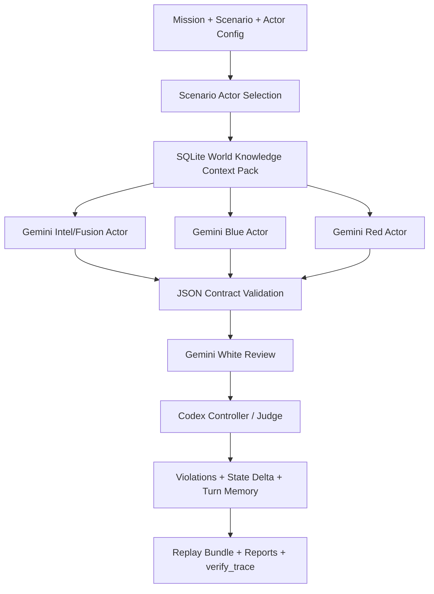

# Indo-Pacific PMESII 兵推 Skill（V4）

[English Version](./README.md)

這是一個用於印太與中東戰略層 PMESII 兵推的 Codex Skill。V4 的主流程是「Gemini actor + Codex/Python controller + SQLite 世界知識庫」：Gemini 負責具體 actor 的角色內推理，Codex/Python 負責回合控制、資料抽取、規則約束、品質閘門、輸出整合與可回放紀錄。

本專案適合政策、戰略、危機管理與結構化分析演練。它有型號級軍事與 PMESII 接地，但用途是戰略模擬；即時 targeting、機密 ORBAT、精確傷亡預測不屬於這個 repo 的承諾範圍。

## 這是什麼

目前流程是 actor-driven：

- Gemini 扮演具體 actor，例如美國、中國、台灣、日本、伊朗、以色列、NATO、GCC、Houthis、Hezbollah。
- Codex/Python 建立 turn packet、查詢 SQLite context、驗證 actor JSON、套用約束、記錄違規、整合報告。
- SQLite 保存 actor 身分、PMESII 指標、capability rules、軍事平台 band、來源 provenance 與 turn memory。
- 舊的 deterministic engine 保留為本地 fallback，可用 `--engine local_synthetic` 執行。

抽象的 `Blue`、`Red`、`White`、`Neutral` 是 scenario role。V4 會依情境把這些 role 映射到具體國家、組織或非國家行為者。

## V4 架構


```mermaid
flowchart TD
    A["Mission + Scenario + Actor Config"] --> B["Scenario Actor Selection"]
    B --> C["SQLite World Knowledge Context Pack"]
    C --> D["Gemini Intel/Fusion Actor"]
    C --> E["Gemini Blue Actor"]
    C --> F["Gemini Red Actor"]
    D --> G["JSON Contract Validation"]
    E --> G
    F --> G
    G --> H["Gemini White Review"]
    H --> I["Codex Controller / Judge"]
    I --> J["Violations + State Delta + Turn Memory"]
    J --> K["Replay Bundle + Reports + verify_trace"]
```

核心分工：

- `Gemini actors`：扮演具體 actor，只能回傳結構化 JSON。
- `Codex controller`：觀察、驗證、裁決、約束並解釋 actor output。
- `Python scripts`：編排 run、建立 context pack、驗證 schema、保存 artifacts、執行 quality gates。
- `SQLite knowledge DB`：提供 actor baseline、PMESII context、capability grounding、軍事建模資料與 provenance。

## V4 每回合怎麼跑

每個 `gemini_actor` turn 依這個 pipeline 執行：

1. 從 `mission.json`、`scenario_pack.json`、`actor_config.json`、`collection_plan.json` 建立 turn packet。
2. 依 scenario 選出具體 actor，映射到 Blue/Red/White/Neutral/Non-state。
3. 查詢 `wargame_knowledge.sqlite`，取得 actor PMESII metrics、capabilities、constraints、military platforms、interaction rules、source claims 與最近 turn memory。
4. 用 `assets/prompts/` 渲染 actor prompt。
5. 呼叫 Gemini actor wrapper；測試時可用 `--mock-gemini` 走 deterministic mock。
6. 依 `assets/schemas/` 驗證所有 actor response。
7. Codex controller 檢查不存在的能力、缺乏資料庫接地、無邊界升級、忽略 countermeasure、White dissent 缺失等問題。
8. 保存 prompt、raw response、parsed JSON、validation report、violations、controller decision 與 replay artifacts。

Gemini 的自由散文不能直接改變 state。只有通過 JSON schema 並經 controller 裁決的 state delta 會進入 replay record。

## SQLite 世界知識庫

V4 把資料庫升級為 `wargame_knowledge.sqlite`，定位是可追溯的 actor 與世界上下文庫。

主要資料表群：

- Actor registry：`world_actors`、`actor_aliases`、`actor_bloc_roles`
- PMESII modeling：`actor_pmesii_metrics`、`metric_sources`
- Military modeling：`military_platforms`、`platform_capabilities`、`weapon_interactions`、`force_posture`
- Capability rules：`capability_rules`、`capability_triggers`、`capability_effects`、`capability_constraints`
- Provenance：`source_documents`、`source_claims`、`field_provenance`
- Diagnostics：`quality_diagnostics`、`benchmark_cases`
- 相容層：`actors`、`actor_doctrine`、`pmesii_indicators`、`capabilities`、`constraints`、`turn_memory`

首批 seed 聚焦印太與中東核心 actor：美國、中國、俄羅斯、台灣、日本、南韓、北韓、伊朗、以色列、沙烏地、阿聯、卡達、土耳其、英國、法國、德國、澳洲、印度、越南、菲律賓、新加坡、NATO、EU、GCC、Houthis、Hezbollah。

詳見 [references/sqlite-knowledge-schema.md](./references/sqlite-knowledge-schema.md)、[references/world-kb-schema.md](./references/world-kb-schema.md)、[references/world-kb-source-policy.md](./references/world-kb-source-policy.md)。

## 軍事建模層

軍事層採戰略級、型號級建模。資料庫記錄 inventory band、platform family、domain、role、readiness band、effect class、countermeasure logic 與 interaction class。

它支援這些檢查：

- actor 是否真的具備它宣稱使用的平台或能力；
- capability 是否有合理 preconditions、latency、costs、risks；
- 對手是否有相關 countermeasures；
- event 是否與 PMESII 與 capability context 接地。

軍事層使用數量 band 與效果區間，避免假精準。局部戰爭事件可作為敘事與分析素材；精確損失數字不納入目前模型。

詳見 [references/military-modeling-rules.md](./references/military-modeling-rules.md)。

## 快速開始

執行 deterministic V4 Gemini-actor smoke campaign：

```powershell
python scripts/run_campaign.py `
  --mission in/mission.json `
  --scenario in/scenario_pack.json `
  --actor-config in/actor_config.json `
  --collection-plan in/collection_plan.json `
  --out out/v4_mock_run `
  --engine gemini_actor `
  --mock-gemini `
  --turns 1
```

建置並檢查 V4 世界知識庫：

```powershell
python scripts/world_kb_import.py `
  --db out/v4_world_kb/wargame_knowledge.sqlite `
  --mission in/mission.json `
  --scenario in/scenario_pack.json `
  --actor-config in/actor_config.json `
  --collection-plan in/collection_plan.json `
  --references-dir references `
  --context-actor Blue
```

執行本地 deterministic fallback：

```powershell
python scripts/run_campaign.py `
  --mission in/mission.json `
  --scenario in/scenario_pack.json `
  --actor-config in/actor_config.json `
  --collection-plan in/collection_plan.json `
  --out out/local_synthetic_run `
  --engine local_synthetic `
  --turns 1
```

## 輸出與回放

典型 V4 run 會產生：

- `wargame_knowledge.sqlite`
- `knowledge_db_manifest.json`
- `replay_bundle/turn_*_actor_context_pack.json`
- `replay_bundle/turn_*_gemini_calls/`
- `replay_bundle/turn_*_controller_decision.json`
- `replay_bundle/turn_*_violations.json`
- `event_ledger.json`
- `key_judgments.json`
- `ach_detailed.json`
- `report_exec.md`
- `report_analyst.md`
- `verify_trace.json`

Gemini call 目錄會保存 `prompt.md`、`raw_response.txt`、`parsed.json`、`validation.json`，方便重跑與 debug。

## 來源政策與品質閘門

資料庫以可追溯為核心。高影響欄位應保存 source URL、publisher、captured time、data year、confidence 與 field-level provenance。

建議來源分層：

- Tier A：官方政府、國防、條約、預算、統計來源。
- Tier B：SIPRI、CIA World Factbook、IISS-style military balance references 與其他 institutional datasets。
- Tier C：Wikipedia/Wikidata，用於 broad actor baseline coverage 與交叉檢查。
- Tier D：scenario-specific open-source claims，保存到 replay artifacts。

品質閘門包括：

- evidence 與 replay 完整性；
- ACH 與 key judgment 一致性；
- actor JSON contract validation；
- PMESII grounding；
- capability 與 platform grounding；
- source provenance coverage；
- White dissent 與 controller violation behavior。

## 測試

```powershell
python -m unittest discover -s tests -p test_v2_unit.py
python -m unittest discover -s tests -p test_pipeline.py
```

常用 manual smoke checks：

```powershell
python scripts/world_kb_import.py `
  --db out/v4_world_kb/wargame_knowledge.sqlite `
  --mission in/mission.json `
  --scenario in/scenario_pack.json `
  --actor-config in/actor_config.json `
  --collection-plan in/collection_plan.json `
  --references-dir references `
  --context-actor Blue

python scripts/run_campaign.py `
  --mission in/mission.json `
  --scenario in/scenario_pack.json `
  --actor-config in/actor_config.json `
  --collection-plan in/collection_plan.json `
  --out out/v4_mock_run `
  --engine gemini_actor `
  --mock-gemini `
  --turns 1
```

## Legacy V2.5 相容模式

V2.5 本地 simulator 仍可用於 deterministic runs、evidence-mode 實驗與 regression tests。它仍支援：

- `synthetic`、`hybrid`、`live_limited` evidence modes；
- source capture manifests、claim registries、evidence clusters；
- AI expert review outputs；
- baseline deviation reports；
- event cards 與 semi-tactical narrative ledgers。

V2.5 artifacts 與 `actor_baseline_db.sqlite` 保留作為相容層。V4 的主要知識層是 `wargame_knowledge.sqlite`。

## 目前限制

- V4 seed database 是第一版世界知識層。部分 actor 的 PMESII 或 capability coverage 仍比 US/CN/TW/IR/IL 等核心 actor 薄。
- 軍事資料採型號級與 banded modeling，可支援戰略接地與違規檢查；精確戰術裁決需要另建模型。
- Live source refresh 還未形成完整自動 ingestion system。V4 已有 provenance schema，後續可接資料更新 pipeline。
- 商業或授權軍事資料匯入前，需要先處理授權條款。

## 參考文件

- [SKILL.md](./SKILL.md)
- [references/gemini-actor-workflow.md](./references/gemini-actor-workflow.md)
- [references/controller-adjudicator-rules.md](./references/controller-adjudicator-rules.md)
- [references/agent-handoffs.md](./references/agent-handoffs.md)
- [references/sqlite-knowledge-schema.md](./references/sqlite-knowledge-schema.md)
- [references/world-kb-schema.md](./references/world-kb-schema.md)
- [references/world-kb-source-policy.md](./references/world-kb-source-policy.md)
- [references/military-modeling-rules.md](./references/military-modeling-rules.md)
- [references/pmesii-normalization.md](./references/pmesii-normalization.md)
