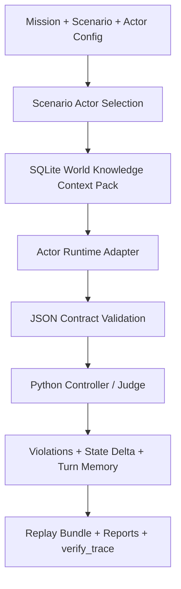

# Indo-Pacific PMESII 兵推 Skill

[](https://github.com/show940125/indo-pacific-pmesii-wargame-skill/actions/workflows/ci.yml)
[](./LICENSE)

[English Version](./README.md) | [版本紀錄](./CHANGELOG.md) | [Apache-2.0 授權](./LICENSE)

> 開發狀態：以 V5 穩定流程為基線，加入 V6 開發中功能。

## 概覽

這是一個開源的戰略層 PMESII 兵推 Skill，支援印太與中東情境的可回放、可追溯分析。Python controller 建立 turn packet、查詢 SQLite 世界知識庫、驗證 actor JSON、套用 constraints、記錄 violations，並產生 replay bundle 與報告。

本專案適合政策、戰略、危機管理、研究與結構化分析演練。它不提供即時 targeting、機密 ORBAT 或精確傷亡預測。

## 專案價值

本 repo 將 actor 模擬、規則檢查、來源 provenance、品質閘門與 replay artifacts 整合為可重用的開源基礎設施。分析者可以檢查情境如何演進，而非只依賴無法追溯的敘事輸出。

## 執行環境

repo 保留一套共享 controller 核心，依執行環境使用不同 actor execution：

| Profile | Actor execution | Shared core |
| --- | --- | --- |
| Gemini / Antigravity plugin | 原生 Antigravity subagents | Python controller、SQLite KB、schemas、prompts、tests、replay artifacts |
| Codex skill | 規劃中的 Antigravity CLI bridge，作為類 subagent actor runtime | 同一套共享核心 |

Codex 端 Antigravity CLI bridge 是後續 adapter 工作，目前尚未列為已支援 runtime。runtime launcher、認證、subagent wiring 與部署設定必須依環境分開維護。

### 同步規則

- Canonical source：Gemini / Antigravity plugin 部署目錄內層的 Git repo。
- 跨部署同步：授權、CHANGELOG、README、schemas、controller logic、SQLite KB、prompts、tests。
- 分開維護：runtime launcher、OAuth 或 CLI bridge、Antigravity 原生 subagent 設定、Codex 部署設定。
- 現有 Codex 安裝版是部署副本，不會自動覆蓋。

## 功能

- 具體國家、同盟與非國家組織 actors。
- SQLite-backed PMESII context、capability rules、軍事平台 bands、provenance 與 turn memory。
- JSON contract validation 與經 controller 裁決的 state mutation。
- 隨機戰鬥裁決、地理轉場延遲、庫存消耗與動態 constraints。
- deterministic mock actors 與 `local_synthetic` fallback，供 regression tests 使用。

## 架構


```mermaid
flowchart TD
    A["Mission + Scenario + Actor Config"] --> B["Scenario Actor Selection"]
    B --> C["SQLite World Knowledge Context Pack"]
    C --> D["Actor Runtime Adapter"]
    D --> E["JSON Contract Validation"]
    E --> F["Python Controller / Judge"]
    F --> G["Violations + State Delta + Turn Memory"]
    G --> H["Replay Bundle + Reports + verify_trace"]
```

只有通過驗證的 actor JSON 與經 controller 裁決的 delta 可以改變 state。詳細流程請參閱 [SKILL.md](./SKILL.md) 與 [references/controller-adjudicator-rules.md](./references/controller-adjudicator-rules.md)。

## 快速開始

執行 deterministic smoke campaign：

```powershell
python scripts/run_campaign.py `
  --mission in/mission.json `
  --scenario in/scenario_pack.json `
  --actor-config in/actor_config.json `
  --collection-plan in/collection_plan.json `
  --out out/v6_mock_run `
  --engine gemini_actor `
  --mock-gemini `
  --turns 1
```

建置並檢查世界知識庫：

```powershell
python scripts/world_kb_import.py `
  --db data/wargame_knowledge.sqlite `
  --mission in/mission.json `
  --scenario in/scenario_pack.json `
  --actor-config in/actor_config.json `
  --collection-plan in/collection_plan.json `
  --references-dir references `
  --context-actor Blue
```

請用 `scripts/query_knowledge_db.py` 作為穩定的 LLM 查詢入口。若情境需要獨立資料庫，可在 `run_campaign.py` 或 `run_turn.py` 使用 `--knowledge-db <path>`。

## 輸出與回放

典型輸出包括：

- `data/wargame_knowledge.sqlite`
- `out/<run>/knowledge_db_manifest.json`
- `replay_bundle/turn_*_actor_context_pack.json`
- `replay_bundle/turn_*_actor_calls/`
- `replay_bundle/turn_*_controller_decision.json`
- `replay_bundle/turn_*_violations.json`
- `event_ledger.json`
- `key_judgments.json`
- `ach_detailed.json`
- `report_exec.md`、`report_analyst.md`、`report_news.md`
- `verify_trace.json`

## 來源政策與品質閘門

高影響資料庫欄位應保存 source URL、publisher、captured time、data year、confidence 與 field-level provenance。建議來源涵蓋官方政府、國防、條約、預算、統計資料、curated institutional datasets 與交叉檢查來源。

品質閘門涵蓋 replay 完整性、ACH 一致性、actor JSON contracts、PMESII grounding、capability 與 platform grounding、provenance coverage、dissent 與 controller violation behavior。商業或受授權限制的軍事資料，匯入前必須遵守原授權條款。

## 測試與 CI

GitHub Actions 會在 Python 3.10 與 3.11 執行測試。

```powershell
python -m unittest discover -s tests -p "test_*.py"
```

## 目前限制

- Seed database 仍是第一版世界知識層；部分 actors 的 coverage 較核心 actors 薄。
- 軍事資料採 model-level 與 banded modeling，適合戰略接地，不是精確戰術裁決。
- Live source refresh 尚未形成完整自動 ingestion system。
- Codex 端 Antigravity CLI actor bridge 仍是規劃中的 adapter 工作。

## 版本紀錄

請參閱 [CHANGELOG.md](./CHANGELOG.md)，其中區分正式標記的 `v2.3.0` release 與後續開發里程碑。

## 授權

本專案採用 [Apache License 2.0](./LICENSE)。署名資訊請參閱 [NOTICE](./NOTICE)。
